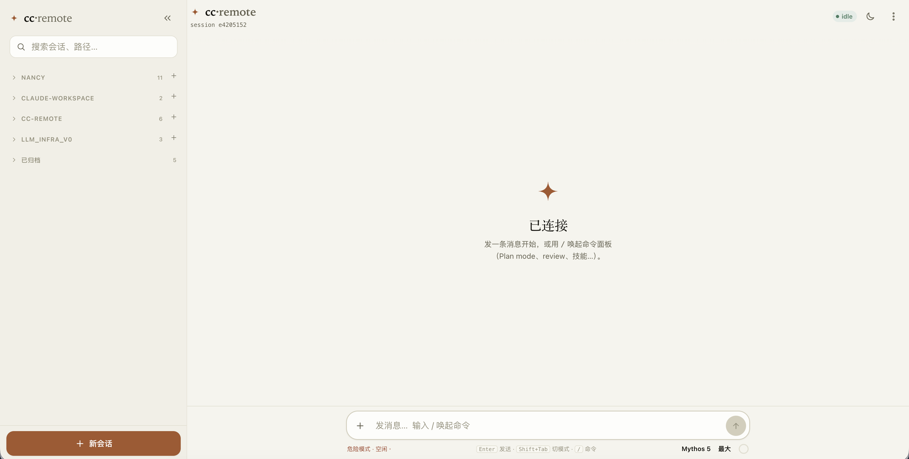
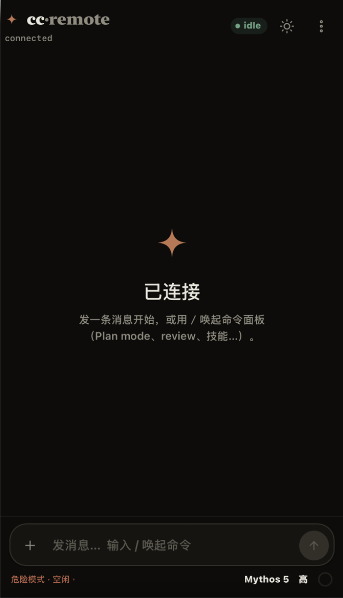

# cc-remote

Drive **Claude Code** running on your machine from a phone or any browser — self-hosted, open source.

A `claude` (Claude Code) session on one machine, remote-controlled in real time from a phone or browser through a WebSocket relay on a VPS: **live streaming, interrupt anytime, multi-device sync, multi-session switching, instant on-demand history**.

> Inspired by Claude Code's official Remote Control, but fully self-hosted with no claude.ai subscription — and the **model backend is yours**: the official Anthropic API, or any Anthropic-compatible endpoint (e.g. a self-hosted GLM / z.AI proxy). cc-remote **never touches the model API**; it only builds the *control* link.

**中文:** [README.md](README.md)

<p align="center">
  
  &nbsp;
  
</p>

---

## Table of contents

- [What it does](#what-it-does)
- [Architecture](#architecture)
- [Quick start (local, one machine, 5 min)](#quick-start-local-one-machine-5-min)
- [Production deploy (public VPS relay + wrapper on your machine)](#production-deploy-public-vps-relay--wrapper-on-your-machine)
- [Environment variables](#environment-variables)
- [Auth model](#auth-model)
- [Security (please read)](#security-please-read)
- [Model backend (optional)](#model-backend-optional)
- [Development](#development)
- [FAQ](#faq)
- [License](#license)

---

## What it does

- 📱 **Real-time remote control from a phone/browser** — drive Claude Code on your home/office machine from anywhere; watch it stream tokens and run tools.
- ⏹️ **Interrupt anytime** — cancel the current turn (handles the SDK's drain semantics correctly, no cross-talk).
- 🔀 **Multi-session** — a resident session pool with a sidebar; background sessions keep running with live status dots.
- 🕘 **Instant history** — history is fetched on demand from the transcript in one bulk payload (like web chats); refresh is fast, no replay flood.
- 🔗 **Multi-device sync** — several devices on the same relay see the same conversation.
- 🔒 **Self-hosted** — the relay is a pure WebSocket forwarder that never touches the model; your code and keys stay on your machine.

## Architecture

Two **independent** links:

```
MODEL LINK (cc-remote never touches):  claude ──(~/.claude/settings.json)──▶ Anthropic API or your compatible endpoint

CONTROL LINK (this repo):              browser ⇄ relay(WebSocket) ⇄ wrapper ⇄ claude-agent-sdk ⇄ claude
```

| Component | Runs where | What it does |
|---|---|---|
| **wrapper** | the machine where `claude` runs | Holds a session pool, translates SDK events to the wire protocol, handles interrupt/drain, reads history from the transcript on demand. **Outbound-only to the relay — no inbound ports needed.** |
| **relay** | public VPS (or local) | Pure WebSocket forwarder (FastAPI). Bearer-token auth, single wrapper slot, multi-client fan-out. **Never imports `claude-agent-sdk`, never touches the model API** — safe to expose publicly. |
| **web** | the browser | React client; the relay serves its static files (`web/dist`) from the same origin. |

## Quick start (local, one machine, 5 min)

First get the relay + wrapper + web running on the **machine where `claude` runs** to validate the whole chain. Production deploy is the next section.

### Prerequisites

- A machine with **Claude Code CLI** (`claude`, v2.1.51+) already installed and **able to chat** (whether you use the official API or a self-hosted proxy — as long as `claude` works).
- **Python 3.10+**, **Node 18+** (to build the web client).

### 1) Install deps + build the web client

```bash
git clone <this-repo> cc-remote && cd cc-remote

python3 -m venv .venv && source .venv/bin/activate
pip install -r requirements.txt

npm --prefix web install
npm --prefix web run build          # produces web/dist/
```

### 2) Configure

```bash
cp .env.example .env
```

Edit `.env` — at minimum:

```ini
# web login password (pick a strong one)
LOGIN_PASSWORD=<a strong password>
# HMAC secret used to sign session tokens
SESSION_SECRET=<openssl rand -hex 32>
# shared token between wrapper and relay
WRAPPER_TOKEN=<openssl rand -hex 32>
# let the relay serve the web client from the same origin
WEB_STATIC_DIR=web/dist
# working directory of the claude session (the project you want it to work on)
CC_CWD=/path/to/your/project
```

> On a single machine the relay and wrapper share this one `.env`.

### 3) Run (two terminals)

```bash
# Terminal 1: relay (serves web + /ws + /api on http://127.0.0.1:8765)
python -m cc_remote.relay

# Terminal 2: wrapper (drives claude)
python -m cc_remote.wrapper
```

### 4) Open the web client

Browse to **http://127.0.0.1:8765** → log in with `LOGIN_PASSWORD` → send a message. You should see streaming replies, interrupt, and multi-session switching.

> To hack on the UI use dev mode: `npm --prefix web run dev` (Vite). For running/testing, the `build` + relay-served approach above is simpler (same origin).

## Production deploy (public VPS relay + wrapper on your machine)

Move the relay to the public internet; the wrapper dials it **outbound** over `wss://`, and phones hit the same domain. The model link is untouched.

```
your machine wrapper ──wss:443──▶ Caddy(VPS, auto HTTPS) ──▶ relay(127.0.0.1:8765) ◀──wss:443── phone browser
                                                                └─ serves web/dist (same origin)
```

### Prerequisites

- **VPS**: Ubuntu/Debian with **ports 80 + 443** open (80 for Let's Encrypt, 443 for wss).
- **Domain**: an A record pointing at the VPS IP (Caddy auto-provisions + renews the TLS cert).
- **Your machine**: Linux (systemd runs the wrapper below), outbound 443 allowed.

### 1) Generate tokens / password

```bash
openssl rand -hex 32   # WRAPPER_TOKEN (must match on relay + wrapper)
openssl rand -hex 32   # SESSION_SECRET (relay)
# also pick a LOGIN_PASSWORD (web login password)
```

### 2) Build the web client on your dev machine

```bash
npm --prefix web install && npm --prefix web run build   # produces web/dist/
```

> The web client no longer bakes any token into the JS: login POSTs the password to the relay for a short-lived session token. So the build needs no `VITE_*` variables.

### 3) Copy code + dist to the VPS

```bash
rsync -av --exclude='.venv' --exclude='web/node_modules' --exclude='.env' \
  ./ <vps-user>@<vps>:/opt/cc-remote/
```

Make sure the VPS has: `/opt/cc-remote/cc_remote/`, `/opt/cc-remote/web/dist/`, `/opt/cc-remote/requirements.txt`, `/opt/cc-remote/deploy/`.

### 4) VPS: fill `.env` + run setup

```bash
# on the VPS
cd /opt/cc-remote
cp deploy/env.relay.example .env
nano .env        # set LOGIN_PASSWORD / SESSION_SECRET / WRAPPER_TOKEN

# install deps + Caddy + systemd (pass your domain)
sudo bash deploy/setup-vps.sh your-domain.com
```

The script installs `python3-venv` + Caddy, creates a `ccremote` system user, builds a venv + `pip install`, writes the Caddyfile, and starts `cc-remote-relay` + `caddy`.

Verify:

```bash
curl https://your-domain.com/healthz
# expect: {"ok":true,"wrapper_connected":false,"clients":0}
```

### 5) Your machine: wrapper `.env` + systemd

```bash
cd /path/to/cc-remote
cp deploy/env.wrapper.example .env
nano .env        # RELAY_URL=wss://your-domain.com/ws, WRAPPER_TOKEN (same as VPS), CC_CWD

python3 -m venv .venv && .venv/bin/pip install -r requirements.txt

# install the systemd service (edit User / paths in the file first)
sudo cp deploy/cc-remote-wrapper.service /etc/systemd/system/
sudo systemctl daemon-reload && sudo systemctl enable --now cc-remote-wrapper
journalctl -u cc-remote-wrapper -f     # expect: connected to relay / wrapper running
```

Back on the VPS, `curl https://your-domain.com/healthz` should now show `wrapper_connected:true`.

### 6) Verify from a phone

Open `https://your-domain.com/` on your phone (any network) → log in with `LOGIN_PASSWORD` → send a message. You should get streaming replies, interrupt, and multi-device sync.

### Behind a corporate HTTP proxy?

The wrapper dials out via `websockets`, which honors `HTTPS_PROXY` / `ALL_PROXY`. Add to the wrapper's `.env`:

```ini
HTTPS_PROXY=http://your-proxy:port      # for SOCKS use ALL_PROXY=socks5://...
```

(If the proxy does TLS MITM, add its root CA to the system trust store.)

## Environment variables

**Relay**

| Var | Default | Notes |
|---|---|---|
| `RELAY_HOST` / `RELAY_PORT` | `127.0.0.1` / `8765` | Listen address (behind Caddy in prod — keep 127.0.0.1). |
| `LOGIN_PASSWORD` | empty | Web login password. **Required** or you can't log in. |
| `SESSION_SECRET` | empty | HMAC secret to sign session tokens. **Required** (`openssl rand -hex 32`). |
| `SESSION_TTL_SECONDS` | `604800` | Session token lifetime (default 7 days). |
| `WRAPPER_TOKEN` | `change-me-wrapper` | Bearer token the wrapper presents; must match on both sides. |
| `WEB_STATIC_DIR` | empty | Point at `web/dist` to serve the web client same-origin; empty = API/WS only. |
| `CLIENT_TOKEN` | *(legacy)* | Old static client token, unused by the web client; ignore. |

**Wrapper**

| Var | Default | Notes |
|---|---|---|
| `RELAY_URL` | `ws://127.0.0.1:8765/ws` | Relay WebSocket URL (`wss://domain/ws` in prod). |
| `WRAPPER_TOKEN` | `change-me-wrapper` | Same as relay. |
| `CC_CWD` | cwd | Working dir of the claude session. `--resume` uses it to locate the session file under `~/.claude/projects/` — **must be correct**. |
| `CC_RESUME_SESSION_ID` | empty | Resume a specific session UUID; empty starts fresh. The id is persisted to `~/.cc-remote/` after first start. |
| `MAX_CONCURRENT_SESSIONS` | `20` | Max resident cc subprocesses (~190MB each). Over the cap → evict an idle one (client keeps cached history; switching back is instant). |
| `DRAIN_TIMEOUT` | `15` | Seconds to wait for the terminal ResultMessage after interrupt before forcing a reconnect (drain safety net). |
| `RING_MAX_EVENTS` / `RING_MAX_BYTES` / `TOOL_RESULT_MAX` | see `.env.example` | Live-tail buffer / tool-output truncation tuning. |

## Auth model

- **Web client**: `POST /api/login` (with `LOGIN_PASSWORD`) to the relay returns a short-lived **HMAC session token** (stored in localStorage), used to connect `/ws`. No token is baked into the JS.
- **Wrapper ⇄ relay**: `Authorization: Bearer <WRAPPER_TOKEN>` at the WS handshake.
- All tokens travel in headers only, never in message bodies; the logger redacts token-named fields.

## Security (please read)

> **cc-remote lets a remote person run arbitrary commands on your machine. Treat it like handing someone a shell.**

- Sessions run with `permissionMode: bypassPermissions` (the premise of unattended remote control), so the agent can run shell / edit files with **no prompt**. **Anyone who can reach the relay *and* knows the login password = anyone who can run commands on your machine.**
- `LOGIN_PASSWORD` / `WRAPPER_TOKEN` / `SESSION_SECRET` are the only gate: use strong random values, never commit them (`.env` is in `.gitignore`), never paste them into chats, rotate them.
- Always use TLS (`wss://`) in production (this repo uses Caddy for automatic certs). Do not expose plain `ws://` publicly.
- Recommended: restrict the relay by IP / only run it when needed; login is rate-limited (5/min per IP) out of the box.

## Model backend (optional)

cc-remote **does not touch the model API** — it drives your local `claude` CLI, which uses whatever backend is already configured in `~/.claude/settings.json`. So:

- **Official Anthropic API**: install `claude`, make sure it can chat, done.
- **Compatible endpoint (e.g. GLM / z.AI)**: set `ANTHROPIC_BASE_URL` in `settings.json` as usual (pointing at an official-compatible endpoint or your own proxy); cc-remote still only does the control link.

## Development

```
cc_remote/
  protocol.py      # pydantic wire protocol (client/relay/wrapper all depend on it)
  config.py        # env-driven config
  relay/           # FastAPI relay: server / auth / pairing / forward
  wrapper/         # sdk / machine(pool + state machine + drain) / stream(SDK→protocol) / ringbuffer / transport
web/               # React client (Vite + TS)
tests/             # zero-token unit tests + e2e scripts
deploy/            # Caddyfile / systemd / setup-vps.sh / env examples
```

```bash
pytest                              # unit tests (no model, zero tokens)
npm --prefix web run dev            # web dev server
npm --prefix web run build          # web production build
```

Architecture notes & contribution contracts are in [CLAUDE.md](CLAUDE.md).

## FAQ

- **Does restarting the wrapper lose history?** No. History comes from the on-disk transcript (read on demand); a wrapper restart only drops the in-memory live-tail buffer and reconnects.
- **Does restarting the relay drop the session?** Briefly disconnects; the client auto-reconnects and the conversation is intact (the session lives on your machine).
- **Do I need inbound ports?** No. The wrapper only dials out to the relay.
- **How expensive is it?** cc-remote itself has zero model cost; browsing / refreshing / viewing history spends no tokens. Actual model cost depends on the backend your `claude` uses.

## License

MIT — see [LICENSE](LICENSE).
