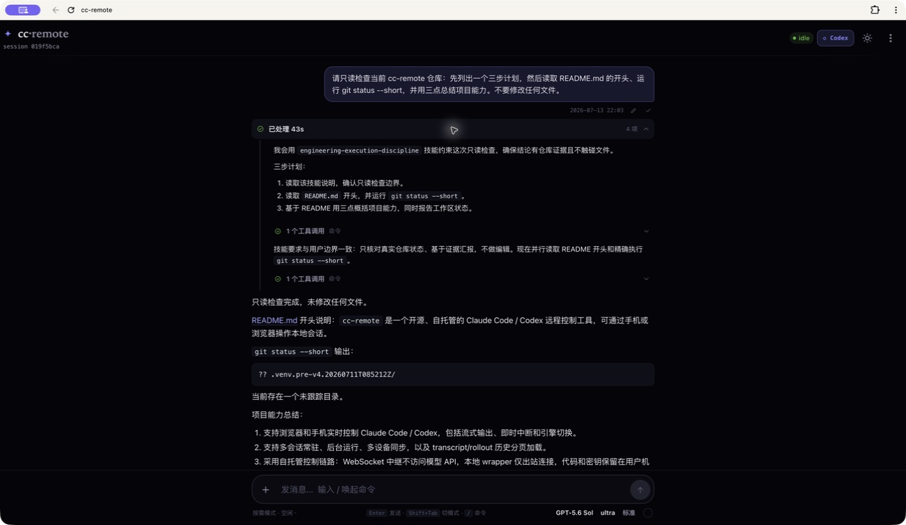
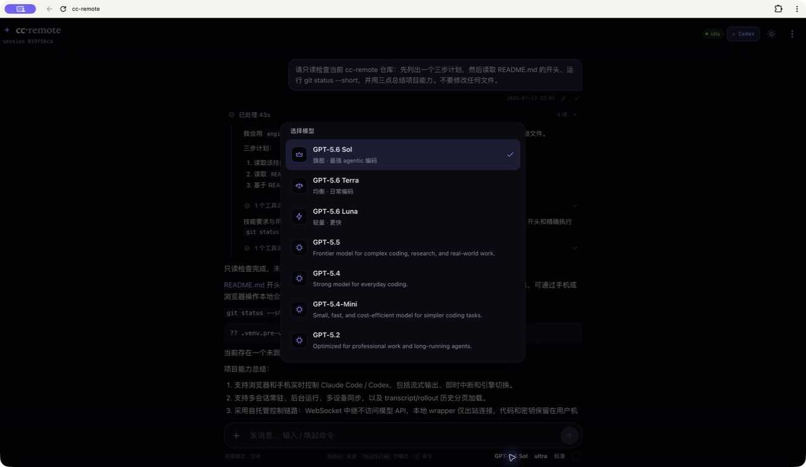

# cc-remote

<p align="center"><strong>Bring Claude Code / Codex on your machine to your phone and any browser.</strong></p>
<p align="center">Self-hosted · Dual-engine · Multi-session · Live process · Responsive Web</p>
<p align="center">
  <a href="README.md">中文</a> ·
  <a href="#quick-start-local-one-machine-5-min">5-minute quick start</a> ·
  <a href="#production-deploy-public-vps-relay--wrapper-on-your-machine">Production deploy</a> ·
  <a href="#security-please-read">Security</a>
</p>

cc-remote is an open-source remote control plane. A local `wrapper` drives the
already installed and authenticated `claude` / `codex` CLI, while browsers view
and control its sessions through your self-hosted WebSocket relay. Models,
authentication, and tool execution remain under the local CLI; cc-remote does
not proxy model APIs or bake API keys into the web client.

<p align="center">
  
</p>

---

## Table of contents

- [Core capabilities](#core-capabilities)
- [Architecture](#architecture)
- [Real interface and practical features](#real-interface-and-practical-features)
- [Quick start (local, one machine, 5 min)](#quick-start-local-one-machine-5-min)
- [Production deploy (public VPS relay + wrapper on your machine)](#production-deploy-public-vps-relay--wrapper-on-your-machine)
- [Environment variables](#environment-variables)
- [Auth model](#auth-model)
- [Reliability boundary](#reliability-boundary)
- [Security (please read)](#security-please-read)
- [Model backend (optional)](#model-backend-optional)
- [Development](#development)
- [FAQ](#faq)
- [License](#license)

---

## Core capabilities

| Scenario | What you can do |
|---|---|
| **Two engines** | Use Claude Code and Codex in the same web UI. Every session keeps its own model, reasoning effort, permissions, and runtime state. |
| **Code / Work spaces** | Code remains repository-oriented. Work is an independent Cowork surface for documents, spreadsheets, presentations, research, and temporary collaboration, with a separate session list. |
| **Work projects and knowledge** | Keep provider-scoped projects, file/link/note sources, and reusable work templates. Starting a Work session materializes the selected context into its private directory. |
| **Work schedules and isolation** | Run one-shot, daily, or weekly tasks with persisted run records, leases, retries, and overlap prevention. Each work item can access only its private directory; add required material explicitly through attachments or the project knowledge collection. |
| **Remote operation** | Watch streaming replies from a phone, tablet, or desktop browser; send attachments, queue the next message, and interrupt the current turn at any time. |
| **Complete process** | Expand the reasoning summaries, plans, command output, file diffs, MCP calls, collaboration agents, Hooks, and terminal interaction events exposed by each engine. |
| **Artifacts and file preview** | Work automatically lists files produced by the current task. Source opens at referenced lines, Markdown is previewable and conflict-safe to edit, HTML renders in an isolated iframe, images/PDF open directly, and DOCX/XLSX/PPTX are previewed after a temporary sandboxed conversion on the wrapper host. |
| **Human approval** | Return Claude `can_use_tool` decisions and Codex command, file-change, user-input, general-permission, and MCP elicitation responses. Mirror a terminal-owned session read-only or take it over explicitly. |
| **Session management** | Search, switch, rename, archive, delete, and fork from individual messages. Codex supports conversation rollback, conflict-safe code rollback, explicit compact, native Review, and isolated Git worktree forks. |
| **Runtime controls** | Change the model, reasoning effort, service tier, permissions, and Plan mode. Codex Code uses `/permissions` for approval control while inheriting the local Sandbox configuration. Use `/goal` for long-running goals and `/status` for read-only app-server status, usage, and rate limits. |
| **Real extension catalog** | Read the current Claude/Codex Skills, Plugins, Apps, and MCP status on demand. Plugin install/uninstall calls the engines' native managers rather than a static placeholder list. |
| **Continuity** | Let background sessions keep running and synchronize them across clients. Restore paged history from Claude transcripts or Codex rollouts and resume from a cursor after reconnecting. |
| **Multi-machine and PWA** | Connect multiple named wrappers to one relay and optionally restrict accounts to selected machines. Install the web client as a PWA and receive generic background completion/failure notifications without conversation content. |
| **Self-hosted** | The wrapper only makes outbound connections. Sessions, Work data, and preview conversion stay on that machine; the replaceable VPS remains a stateless relay. Web auth uses an HttpOnly cookie, and CLI credentials or API keys never enter the frontend. |

> Available models, service tiers, and runtime controls depend on the local CLI and the capabilities exposed by its SDK or app-server.

## Architecture

Two **independent** links:

```
MODEL LINK (cc-remote never touches):  claude / codex ──(their local config)──▶ model service

CONTROL LINK (this repo):              browser ⇄ relay(WebSocket) ⇄ wrapper ⇄ SDK / app-server ⇄ local CLI
```

| Component | Runs where | What it does |
|---|---|---|
| **wrapper** | the machine where `claude` / `codex` runs | Holds a session pool, translates SDK/app-server events to the wire protocol, handles interrupt/drain, reads transcript/rollout history on demand, and temporarily converts Office previews locally. **Outbound-only to the relay — no inbound ports needed.** |
| **relay** | public VPS (or local) | Pure WebSocket forwarder (FastAPI). It keeps one wrapper slot per `machine_id`; browsers use an HttpOnly session cookie and receive events only from their selected machine. **Does not persist sessions or artifacts, never imports `claude-agent-sdk`, and never touches the model API.** |
| **web** | the browser | React client; the relay serves its static files (`web/dist`) from the same origin. |

### Code and Work

The **Code / Work** switch at the top of the sidebar reuses the same Claude and
Codex engines while isolating storage, session lists, and permissions:

- **Code** preserves the existing repository-oriented behavior for development,
  debugging, and deployment.
- **Work** targets documents, spreadsheets, presentations, research, knowledge
  collections, and temporary chats. Claude stores it under
  `~/.claude/cc-remote/work` and Codex under `~/.codex/cc-remote/work` by default.
  Every work item has its own `workspace/` and uploads. Artifacts are ordinary
  files produced inside that workspace. Deletion is limited to a directory that
  the registry proves belongs to Work. Work replaces both CLIs' coding-oriented
  base prompts: casual chat does not inspect files or mention code projects, while
  explicit software requests can still use the same engines and tools.
- Work does not expose the home directory or arbitrary external directories.
  Add existing material explicitly through attachments or the project knowledge
  collection so a conversation cannot discover unrelated projects or history.
- A Work template is an instruction/workflow template written into the
  project's `WORK.md`; it does not execute unreviewed third-party code. Scheduled
  tasks are persisted and claimed by the wrapper under the same Work isolation.

### How native terminals and Remote cooperate

Code sessions follow each CLI's real control plane without replacing official
commands:

- **Claude:** `claude` always remains the official command and official TUI;
  cc-remote installs no alias, shim, or PATH interception. Sessions opened directly
  by `claude`, Claude Desktop, or Agent View are read-only mirrors in Remote by
  default, which prevents two independent input owners. For bidirectional terminal
  and Remote control, explicitly run `claude-remote`: a same-user local broker runs
  the real official `claude` inside a PTY, the terminal still renders the complete
  official TUI, and Remote shares that session. Migration is always user-initiated.
  For a direct CLI session it sends SIGTERM only to the exact same-user Claude
  process identity; it never kills the terminal shell, escalates to SIGKILL, or
  takes over a process silently.
- **Codex Code:** prefers Codex's official shared app-server daemon, so native
  Codex clients and Remote share the thread and control state. If the installed
  version cannot provide it, cc-remote explicitly falls back to a private
  app-server. Set `CC_REMOTE_CODEX_DAEMON=off` for troubleshooting.
- **Work:** Claude and Codex Work keep private processes and directories and do
  not join the Code control plane, preventing work material from leaking into code
  sessions.

The `claude-remote` broker listens only on a same-user Unix socket and opens no
TCP port. The wrapper and terminal TUI must run as the same OS user and use the
same socket path.

### Where artifact preview runs

- HTML is sanitized with DOMPurify in the browser and rendered in a scriptless,
  network-blocked sandbox iframe.
- PNG/JPEG/GIF/WebP/AVIF and PDF are path-, type-, and size-checked by the wrapper,
  then returned only to the requesting browser through the authenticated WebSocket.
- DOC/DOCX/ODT/RTF, XLS/XLSX/ODS, and PPT/PPTX/ODP are converted to PDF by
  LibreOffice on the **wrapper host**. On Linux, bubblewrap removes network and
  user-directory access and mounts only that request's temporary directory. The
  directory is deleted immediately after conversion.
- The VPS relay forwards bounded preview frames and stores neither originals nor
  converted files. Replacing the VPS requires no session migration. Moving to a
  new wrapper device means migrating the local transcripts/rollouts, Work roots,
  and cc-remote state.

## Real interface and practical features

The screenshots below come from a running cc-remote installation, not design mockups.

### Multi-session management: keep work running in the background

The session pool groups conversations by working directory and lets you search,
switch, rename, and archive them. You can move to another session while one is
still working in the background, then return to its complete live progress.
Claude Code and Codex share the same workspace while retaining independent
context, models, permissions, and runtime state.

<p align="center">
  
</p>

### Claude Code: see reasoning, tool calls, and Hooks

A Claude session is more than a simplified chat showing only the final text.
cc-remote receives the reasoning, command calls, tool results, and Hook lifecycle
events exposed by the Claude Code SDK and presents them as a collapsible timeline.
The composer also shows the session's current model, reasoning effort, permission
mode, and context usage.

<p align="center">
  
</p>

### New sessions: choose the engine and working directory first

Create either a Claude Code or Codex session from one entry point, browse for its
working directory, and attach images or files to the first message. Once the
session exists, adjust its model, permissions, or Plan mode only when needed
instead of filling in a row of defaults up front.

<p align="center">
  
</p>

### Codex: preserve plans and the complete process

Codex sessions organize the reasoning summaries, plans, commands, diffs, MCP
calls, collaboration agents, and Hooks reported by app-server into a collapsible
timeline. Expand it while a turn is running to follow the details, then collapse
the completed work into a concise summary; the final response always remains
separate.

<p align="center">
  
</p>

### Per-session Codex controls: model, reasoning, permissions, and status

The model, reasoning effort, service tier, and permissions belong to the current
session, so you can change the next turn without editing the machine's global
configuration. The composer also provides attachments, queue/interrupt controls,
context usage, and command entry points such as `/goal` and `/status`.

<p align="center">
  
</p>

### Common operations at a glance

- **Sessions:** create, search, run in the background, rename, archive, delete, fork, roll back Codex conversation and code, compact, Review, and create a Codex worktree.
- **Turns:** stream, queue, interrupt, copy, edit and resend, or fork from a specific message.
- **Tools:** inspect command output, file changes and diffs, MCP, collaboration agents, Hooks, approvals, and user-input requests.
- **Terminal coordination:** Codex Code shares the official daemon; Claude uses
  explicit `claude-remote` to preserve the official TUI with bidirectional control.
  Direct `claude` / Desktop / Agent View processes remain read-only mirrors.
- **Status:** inspect the model, reasoning effort, permissions, Plan mode, context, goals, usage, rate limits, and runtime warnings.
- **Extensions:** inspect live Skills, Plugins, Apps, and MCP status and install/uninstall plugins through the native engine manager.
- **Devices:** use a responsive mobile UI, light or dark themes, multi-browser/multi-machine synchronization, PWA installation, background completion alerts, and reconnect recovery.

## Quick start (local, one machine, 5 min)

First get the relay + wrapper + web running on the **machine where the agent CLI runs** to validate the whole chain. Production deploy is the next section.

### Prerequisites

- A machine signed in to **Claude Code** or to a **Codex CLI** that supports `app-server`, with the CLI itself already **able to chat**. Claude uses the official CLI bundled with the locked and regression-tested SDK by default; each new Codex app-server reselects the newest usable local install. Make both available to switch engines in the web UI.
- **Python 3.10+**, **Node 20.19+** (to build the web client).
- Optional: Office artifact preview requires **LibreOffice + bubblewrap** on the
  Linux wrapper host (for example, `sudo apt install libreoffice bubblewrap`).
  The VPS does not need either package.

### 1) Install deps + build the web client

```bash
git clone https://github.com/muggle-stack/cc-remote.git && cd cc-remote

python3 -m venv .venv && source .venv/bin/activate
pip install --require-hashes --only-binary=:all: -r requirements.lock

npm --prefix web ci
npm --prefix web run build          # produces web/dist/
```

Optional: install the **separately named** launcher for bidirectional control
between the official Claude TUI and Remote (it does not modify `claude`):

```bash
mkdir -p "$HOME/.local/bin"
ln -sfn "$PWD/scripts/claude-remote" "$HOME/.local/bin/claude-remote"

claude-remote                         # auto-start broker, create and attach official TUI
claude-remote list                    # list broker-owned sessions
claude-remote resume SESSION_UUID --cwd /path/to/project
```

Continue to run `claude` directly when you want the fully native process with a
read-only Remote mirror.

### 2) Configure

```bash
install -m 600 .env.example .env
```

Edit `.env` — at minimum:

```ini
# web login password (pick a strong one)
LOGIN_PASSWORD=<a strong password>
# HMAC secret used to sign session tokens
SESSION_SECRET=<openssl rand -hex 32>
# shared token between wrapper and relay
WRAPPER_TOKEN=<openssl rand -hex 32>
# exact browser origin; plain HTTP is allowed only on loopback
PUBLIC_ORIGIN=http://127.0.0.1:8765
# let the relay serve the web client from the same origin
WEB_STATIC_DIR=web/dist
# default working directory of the agent session (the project you want it to work on)
CC_CWD=/path/to/your/project
# optional explicit Claude CLI path when systemd/PATH cannot find it
CLAUDE_BIN=/absolute/path/to/claude
```

> For a local loopback quick start, the relay and wrapper may share this `.env`;
> it is not a production secret store. A public deployment must use the
> root-only `/etc/cc-remote/wrapper.env` below so bypass-permissions model/tools
> cannot read control-plane credentials directly.

### 3) Run (two terminals)

```bash
# Terminal 1: relay (serves web + /ws + /api on http://127.0.0.1:8765)
python -m cc_remote.relay

# Terminal 2: wrapper (drives the local claude / codex CLI)
python -m cc_remote.wrapper
```

### 4) Open the web client

Browse to **http://127.0.0.1:8765** → log in with `LOGIN_PASSWORD` → send a message. You should see streaming replies, interrupt, and multi-session switching.

> To hack on the UI use dev mode: `npm --prefix web run dev` (Vite). For running/testing, the `build` + relay-served approach above is simpler (same origin).

## Production deploy (public VPS relay + wrapper on your machine)

Move the relay to the public internet; the wrapper dials it **outbound** over `wss://`, and phones hit the same domain. The model link is untouched.

```
your machine wrapper ──wss:443──▶ Caddy(VPS, auto HTTPS) ──▶ relay(127.0.0.1:8765) ◀──wss:443── phone browser
                                                                └─ serves web/dist (same origin)
```

### Prerequisites

- **VPS**: Ubuntu 22.04+ / Debian 12+ (or another Debian-family host with Python 3.10+) with **ports 80 + 443** open (80 for Let's Encrypt, 443 for wss).
- **Domain**: an A record pointing at the VPS IP (Caddy auto-provisions + renews the TLS cert).
- **Your machine**: Linux (systemd runs the wrapper below), outbound 443 allowed.

### 1) Generate tokens / password

```bash
openssl rand -hex 32   # WRAPPER_TOKEN (must match on relay + wrapper)
openssl rand -hex 32   # SESSION_SECRET (relay)
# also pick a LOGIN_PASSWORD (web login password)
```

### 2) Build the web client on your dev machine

```bash
npm --prefix web ci
npm --prefix web run build   # produces web/dist/
```

> The web client no longer bakes any token into the JS: login POSTs the password to the relay for a short-lived session token. So the build needs no `VITE_*` variables.

> **Upgrading to protocol v15:** the wire gate rejects mixed versions. Deploy
> `cc_remote/` and the new `web/dist/` in one maintenance window, then restart the
> relay and wrapper; do not run a rolling mixture. Existing sockets reconnect
> briefly, and a relay restart intentionally requires browsers to log in again.
> Any already-open older page also needs one **hard refresh** to load the new hashed
> assets; logging in again inside the old JavaScript bundle isn't sufficient.
> For a manual release, stop the local wrapper first, stop and update relay + web,
> then start the v15 relay and v15 wrapper so the old wrapper cannot occupy the
> slot for the same `machine_id`.

### 3) Upload staging, then publish it as an atomic release

```bash
# dev machine: the normal account writes its own staging directory, not root-owned /opt
rsync -av --delete --exclude='.git' --exclude='.venv' \
  --exclude='web/node_modules' --exclude='.env' \
  ./ <vps-user>@<vps>:~/cc-remote-upload/

# VPS: never overlay the running /opt tree with the staging upload
ssh <vps-user>@<vps>
sudo mkdir -p /opt/cc-remote
```

The installer copies staging into a new
`/opt/cc-remote/releases/release-*`, builds a release-local venv, and switches
`/opt/cc-remote/current` atomically only after every check passes. The previous
full code, `web/dist`, and venv remain available for rollback; the dirty live
tree is never updated with `rsync --delete`.

### 4) VPS: fill `.env` + run setup

```bash
# on the VPS: .env is the only runtime config shared by releases
sudo test -f /opt/cc-remote/.env || sudo install -m 600 \
  ~/cc-remote-upload/deploy/env.relay.example /opt/cc-remote/.env
sudoedit /opt/cc-remote/.env
# set LOGIN_PASSWORD / SESSION_SECRET / WRAPPER_TOKEN and keep:
# WEB_STATIC_DIR=/opt/cc-remote/current/web/dist

# for upgrades, stop the local wrapper first; then switch relay + web together
sudo bash ~/cc-remote-upload/deploy/setup-vps.sh \
  your-domain.com ~/cc-remote-upload
```

The script installs `python3-venv` + Caddy, creates the `ccremote` service user,
builds an immutable release and its venv, merges Caddy configuration, atomically
switches `current`, and restarts the relay. If restart/readiness fails, `current`,
the Caddyfile, and the systemd unit roll back as one transaction and the previous
release's `/healthz` is verified. Start the v15 wrapper after success.

Verify:

```bash
curl https://your-domain.com/healthz
# expect: {"ok":true,"wrapper_connected":false,"clients":0}
```

### 5) Your machine: root-only wrapper environment + systemd

For Office artifact preview, install the converter sandbox on this wrapper host,
not on the VPS:

```bash
sudo apt-get update && sudo apt-get install -y libreoffice bubblewrap
```

```bash
cd /path/to/cc-remote
python3 -m venv .venv
.venv/bin/pip install --require-hashes --only-binary=:all: -r requirements.lock

# Root owns the secret source; model/tools run as your ordinary account and
# cannot read this file directly.
sudo install -d -o root -g root -m 0755 /etc/cc-remote
sudo install -o root -g root -m 0600 deploy/env.wrapper.example \
  /etc/cc-remote/wrapper.env
sudoedit /etc/cc-remote/wrapper.env  # set RELAY_URL / WRAPPER_TOKEN / CC_CWD

# Edit User and repository/venv/home paths; do not point it back at a repo .env.
sudo cp deploy/cc-remote-wrapper.service /etc/systemd/system/
sudo systemctl daemon-reload && sudo systemctl enable --now cc-remote-wrapper
journalctl -u cc-remote-wrapper -f     # expect: connected to relay / wrapper running
```

To enable bidirectional Claude terminal coordination, set
`CC_REMOTE_CLAUDE_BROKER_SOCKET` to the same absolute path in
`/etc/cc-remote/wrapper.env` and the terminal environment, then install the
launcher for the same ordinary user that runs the wrapper:

```bash
mkdir -p "$HOME/.local/bin"
ln -sfn /path/to/cc-remote/scripts/claude-remote "$HOME/.local/bin/claude-remote"
export CC_REMOTE_CLAUDE_BROKER_SOCKET="$HOME/.cc-remote/claude-broker.sock"
claude-remote                         # auto-starts on first use; no broker service needed
```

Never rename `claude-remote` to `claude` and never alias the official command.

Back on the VPS, `curl https://your-domain.com/healthz` should now show `wrapper_connected:true`.

### 6) Verify from a phone

Open `https://your-domain.com/` on your phone (any network) → log in with `LOGIN_PASSWORD` → send a message. You should get streaming replies, interrupt, and multi-device sync.

### Behind a corporate HTTP proxy?

The wrapper dials out via `websockets`, which honors `HTTPS_PROXY` / `ALL_PROXY`.
Add it to `/etc/cc-remote/wrapper.env`:

```ini
HTTPS_PROXY=http://your-proxy:port      # for SOCKS use ALL_PROXY=socks5://...
```

(If the proxy does TLS MITM, add its root CA to the system trust store.)

## Environment variables

**Relay**

| Var | Default | Notes |
|---|---|---|
| `RELAY_HOST` / `RELAY_PORT` | `127.0.0.1` / `8765` | Listen address (behind Caddy in prod — keep 127.0.0.1). |
| `LOGIN_PASSWORD` | empty | Single-user web login password. **Required** unless `LOGIN_USERS_JSON` is set. |
| `LOGIN_USERS_JSON` | empty | Optional multi-user policy: `{"alice":{"password":"…","machines":["mac","nono"]}}`; replaces `LOGIN_PASSWORD`. |
| `SESSION_SECRET` | empty | HMAC secret to sign session tokens. **Required** (`openssl rand -hex 32`). |
| `SESSION_TTL_SECONDS` | `604800` | Session token lifetime (default 7 days). |
| `LOGIN_BODY_MAX_BYTES` / `LOGIN_READ_TIMEOUT` / `LOGIN_INFLIGHT_CAP` | `4096` / `10` / `32` | Hard limits for login body bytes, total read seconds, and concurrent body reads. |
| `SESSION_REGISTRY_CAP` | `1024` | Hard limit for process-local revocable browser sessions. |
| `PUSH_VAPID_PUBLIC_KEY` / `PUSH_VAPID_PRIVATE_KEY` / `PUSH_VAPID_SUBJECT` | empty | Optional real Web Push; all three must be configured. Prefer an absolute PEM path readable by the relay user. Payloads contain only completion/failure state, never conversation content. |
| `PUSH_DB_PATH` | `~/.cc-remote/relay-push.sqlite3` | Durable browser subscription store, isolated by user and machine. |
| `PUBLIC_ORIGIN` | empty | Exact browser origin allowed to connect, e.g. `https://remote.example.com`; **required**, and non-loopback origins must use HTTPS. |
| `WRAPPER_TOKEN` | placeholder | Wrapper Bearer token for single-machine/compatibility mode; required unless `WRAPPER_TOKENS_JSON` is set. |
| `WRAPPER_TOKENS_JSON` | empty | Optional machine-bound tokens: `{"mac":"…","nono":"…"}`; replaces the relay's wildcard `WRAPPER_TOKEN`. |
| `WEB_STATIC_DIR` | empty | Point at `web/dist` to serve the web client same-origin; empty = API/WS only. |
| `CLIENT_QUEUE_CAP` / `CLIENT_QUEUE_BYTES` | `4096` / `16777216` | Hard per-client pending-frame/byte limits; a slow client is disconnected instead of silently losing frames. |
| `MAX_CLIENTS` / `CLIENT_HELLO_TIMEOUT` | `8` / `10` | Hard limits for accepted clients and seconds allowed for the first Hello frame. |
| `WS_MAX_SIZE_BYTES` | `16777216` | Maximum single WebSocket frame accepted by both relay and wrapper transports. |

**Wrapper**

| Var | Default | Notes |
|---|---|---|
| `RELAY_URL` | `ws://127.0.0.1:8765/ws` | Relay WebSocket URL (`wss://domain/ws` in prod). |
| `WRAPPER_TOKEN` | `change-me-wrapper` | Same as relay. |
| `CC_REMOTE_MACHINE_ID` | `default` | Stable route id on a multi-machine relay; must match its `WRAPPER_TOKENS_JSON` key when that policy is enabled. |
| `CLAUDE_BIN` | empty | Optional absolute Claude CLI path; set it when systemd/PATH cannot find `claude`. |
| `CC_REMOTE_CLAUDE_BROKER_SOCKET` | `$XDG_RUNTIME_DIR/cc-remote/claude-broker.sock`, or `~/.cc-remote/claude-broker.sock` without XDG | Same-user Unix socket shared by `claude-remote` and the wrapper. For systemd, explicitly configure the same absolute path on both sides. |
| `CLAUDE_REMOTE_CLAUDE_BIN` | `claude` | Selects the real official Claude Code executable for the `claude-remote` broker only; it never changes the official command. |
| `CC_REMOTE_CODEX_DAEMON` | `auto` | Code prefers Codex's official shared daemon; `off` forces private stdio app-server. Work is always private and ignores this setting. |
| `CC_CWD` | cwd | Default working directory for new sessions. Claude `--resume` needs it to locate `~/.claude/projects/` — **it must be correct**; Codex resume first recovers the original cwd from its rollout. |
| `CC_RESUME_SESSION_ID` | empty | Resume a specific session UUID; empty starts fresh. The id is persisted to `~/.cc-remote/` after first start. |
| `CLAUDE_WORK_ROOT` | `~/.claude/cc-remote/work` | Private Claude Work root for the registry, knowledge sources, sessions, and generated policy files. |
| `CODEX_WORK_ROOT` | `~/.codex/cc-remote/work` | Private Codex Work root for the registry, knowledge sources, sessions, and generated policy files. |
| `MAX_CONCURRENT_SESSIONS` | `20` | Maximum resident agent subprocesses (memory varies by engine/version). Over the cap, an idle process is evicted; client history remains available. |
| `DRAIN_TIMEOUT` | `15` | Seconds to wait for the terminal ResultMessage after interrupt before forcing a reconnect (drain safety net). |
| `CODEX_TURN_IDLE_WARN_SECONDS` | `90` | Show a non-terminal waiting notice after this many seconds without a Codex app-server event; `0` disables it. It does not auto-interrupt long reasoning or tools. |
| `RING_MAX_EVENTS` / `RING_MAX_BYTES` / `TOOL_RESULT_MAX` | see `.env.example` | Live-tail buffer / tool-output truncation tuning. |
| `HISTORY_SOURCE_MAX_BYTES` | `67108864` | Maximum transcript/rollout source file read; larger histories return an explicit error instead of exhausting memory. |
| `WRAPPER_INBOX_CAP` / `WRAPPER_SEND_QUEUE_CAP` | `1024` / `8192` | Hard item-count bounds for the wrapper's inbound and outbound queues. |
| `WRAPPER_INBOX_BYTES` / `WRAPPER_SEND_QUEUE_BYTES` | `33554432` / `33554432` | Hard serialized-byte bounds for the wrapper's inbound and outbound queues. |
| `TURN_READER_QUEUE_CAP` | `4` | Per-turn SDK/app-server reader queue; a full queue backpressures the model stream. |

Each message accepts at most 8 attachments, at most 6 MiB each and 8 MiB decoded in total; oversized input is rejected before a model turn starts.

## Auth model

- **Web client**: `POST /api/login` creates a short-lived HMAC session in an **HttpOnly, SameSite=Strict** cookie. JavaScript cannot read it and no token appears in the URL. With `LOGIN_USERS_JSON`, the signed session also carries its allowed machines; both discovery and WebSocket routing enforce that set. The WebSocket must also pass an exact `Origin` check.
- **Wrapper ⇄ relay**: `Authorization: Bearer <WRAPPER_TOKEN>` at the WS handshake. With `WRAPPER_TOKENS_JSON`, that credential can declare only its bound `machine_id`.
- Tokens travel only in cookies/headers, never in URLs or wire-protocol message bodies; logging redacts token/password fields.

## Reliability boundary

- The Web and TUI attach a stable `cmd_id` to retryable commands and resend them after a socket reconnect or wrapper recovery. The wrapper deduplicates them and ACKs completion within the same wrapper process lifetime. Each live session also pairs its cursor with a wrapper generation so a restart cannot make an old sequence number look current.
- Unacknowledged-command queues and the general command-deduplication table are **bounded in-memory state**. A hard browser refresh, TUI exit, or wrapper crash does not promise cross-process exactly-once delivery. cc-remote is an interactive control plane, not a durable job queue; after such a failure, inspect the transcript/rollout and live session state before resending.
- Persisted Claude transcripts and Codex rollouts are the history source of truth. The live ring only provides bounded reconnect catch-up; it does not replace those files.
- Work schedules are the exception: schedules, run records, leases, heartbeats, retry counts, and next-run timestamps live in SQLite. An expired lease is recovered after a wrapper restart, but an uncertain outcome is never reported as success.

## Security (please read)

> **cc-remote lets a remote person run arbitrary commands on your machine. Treat it like handing someone a shell.**

- Code sessions remain a remote development control plane: Claude defaults to `permissionMode: bypassPermissions`, and Codex defaults to approval policy `never` while inheriting the machine's Codex sandbox configuration; both can expose approval controls in the web client. **Treat anyone who can log in and enter Code as holding remote agent/shell authority on the wrapper machine.** Work uses a separate private root and does not expose external directories, but this only narrows the default capability surface; it is not a substitute for OS-user, container, or VM isolation.
- `LOGIN_PASSWORD` / `LOGIN_USERS_JSON`, `WRAPPER_TOKEN` / `WRAPPER_TOKENS_JSON`, and `SESSION_SECRET` form the authentication boundary: use strong random values, never commit or paste them into chats, and rotate them. A repository `.env` is for local development only; production wrappers must use the root-only `/etc/cc-remote/wrapper.env` above. The systemd template prevents the service and model descendants from reading that source file or a legacy repository `.env`; on Linux the wrapper also disables dumpability so children cannot recover captured credentials through `/proc/<pid>/environ` or process memory.
- Always use TLS (`wss://`) in production (this repo uses Caddy for automatic certs). Do not expose plain `ws://` publicly.
- Recommended: restrict the relay by IP / only run it when needed; login is rate-limited (5/min per IP) out of the box.

## Model backend (optional)

cc-remote **does not touch the model API** — it drives already-configured local CLIs. Claude uses `~/.claude/settings.json`; Codex uses its own login and `~/.codex/config.toml`. So:

- **Official Anthropic API**: install `claude`, make sure it can chat, done.
- **Compatible endpoint (e.g. GLM / z.AI)**: set `ANTHROPIC_BASE_URL` in `settings.json` as usual (pointing at an official-compatible endpoint or your own proxy); cc-remote still only does the control link.
- **Codex**: first make sure local `codex` can chat and `codex app-server` starts. cc-remote neither reads its API key nor rewrites global authentication.

## Development

```
cc_remote/
  protocol.py      # pydantic wire protocol (client/relay/wrapper all depend on it)
  config.py        # env-driven config
  relay/           # FastAPI relay: server / auth / pairing / forward
  wrapper/         # Claude SDK + Codex app-server / pool / stream / ringbuffer / transport
web/               # React client (Vite + TS)
tests/             # zero-token unit tests + e2e scripts
deploy/            # Caddyfile / systemd / setup-vps.sh / env examples
```

```bash
python -m pip install -r requirements-dev.txt
pytest                              # unit tests (no model, zero tokens)
npm --prefix web run test:reliability # pure web reliability tests

# Explicit live path (requires a running relay + wrapper and calls the model)
CC_REMOTE_RUN_E2E=1 CC_REMOTE_E2E_SCENARIO=smoke \
  RELAY_URL=wss://remote.example/ws LOGIN_PASSWORD='...' \
  pytest -q tests/test_e2e_entry.py
npm --prefix web run lint           # web static checks
npm --prefix web run dev            # web dev server
npm --prefix web run build          # web production build
```

Architecture notes & contribution contracts are in [CLAUDE.md](CLAUDE.md).

## FAQ

- **Does restarting the wrapper lose history?** Persisted history does not disappear; it comes from Claude transcripts / Codex rollouts. A restart does lose unacknowledged in-memory commands and the live ring; see the reliability boundary above.
- **Does restarting the relay drop the session?** It briefly disconnects and requires login again because the process-local revocation registry resets. The conversation remains intact on the wrapper machine.
- **Can I replace the VPS or move to a new device?** Yes. The VPS only serves the relay and static web bundle; it is not the session authority. Deploy the same version on the new VPS and point the wrapper at its new `RELAY_URL`. To move the wrapper, copy the Claude transcripts, Codex rollouts, `CLAUDE_WORK_ROOT` / `CODEX_WORK_ROOT`, and `~/.cc-remote`, re-authenticate each CLI on the new machine, then start the wrapper.
- **Do I need inbound ports?** No. The wrapper only dials out to the relay.
- **How expensive is it?** cc-remote itself has zero model cost; browsing / refreshing / viewing history spends no tokens. Actual model cost depends on the backend used by the local agent CLI.

## License

MIT — see [LICENSE](LICENSE).
